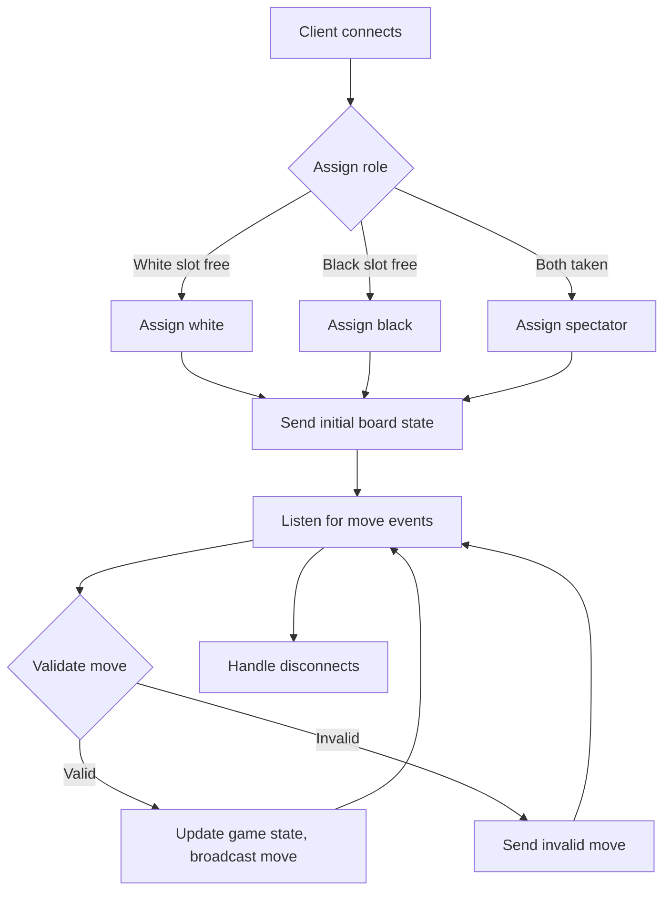

# Chess.com Clone

A real-time multiplayer chess game built with Node.js, Express, Socket.io, chess.js, and EJS. This project allows two players to play chess in real time, with additional users able to join as spectators. The frontend is styled with Tailwind CSS and custom CSS, and the chess logic is powered by the chess.js library.

---

## Table of Contents

- [Features](#features)
- [Project Structure](#project-structure)
- [How It Works](#how-it-works)
- [Architecture Diagram](#architecture-diagram)
- [Frontend Flow](#frontend-flow)
- [Backend Flow](#backend-flow)
- [Setup & Usage](#setup--usage)
- [Credits](#credits)

---

## Features

- Real-time chess gameplay using WebSockets (Socket.io)
- Drag-and-drop chess pieces
- Automatic board flipping for black player
- Spectator mode for additional users
- Unicode chess pieces for cross-platform compatibility
- Responsive and modern UI

---

## Project Structure

```
Chess/
├── app.js
├── package.json
├── public/
│   ├── css/
│   └── js/
│       └── chessgame.js
├── views/
│   └── index.ejs
└── README.md
Resource/
├── backendSetup.yaml
├── frontendSetup.yaml
└── ...
```

---

## How It Works

### 1. Player Connection

- When a user connects, the server assigns them as white, black, or spectator based on availability.
- The chessboard is rendered dynamically in the browser.
- Players can drag and drop pieces to make moves. Only valid moves are accepted.
- Moves are sent to the server, validated, and broadcast to all clients.
- The board automatically updates for all players and spectators in real time.
- The board flips for the black player for a realistic experience.

### 2. Game Logic

- The chess logic (move validation, turn management, FEN serialization) is handled by [chess.js](https://github.com/jhlywa/chess.js).
- The frontend listens for events from the server and updates the board accordingly.

---

## Architecture Diagram

```mermaid
graph TD
    A[Client 1 (White)] -- Socket.io --> C[Node.js Server]
    B[Client 2 (Black)] -- Socket.io --> C
    D[Spectator Clients] -- Socket.io --> C
    C -- Board State, Moves --> A
    C -- Board State, Moves --> B
    C -- Board State --> D
    C -- Uses --> E[chess.js]
    C -- Serves --> F[Static Files (JS, CSS, EJS)]
```

---

## Frontend Flow

```mermaid
flowchart TD
    A[User opens browser] --> B[Connects via Socket.io]
    B --> C[Receives role (white/black/spectator)]
    C --> D[Initial board render]
    D --> E[User drags piece]
    E --> F[Move sent to server]
    F --> G[Wait for server validation]
    G --> H[Board updates for all clients]
```

- **Socket.io Initialization:**  
  Establishes a WebSocket connection to the server.

- **Chess Game Initialization:**  
  Uses chess.js to manage game state.

- **DOM Manipulation:**  
  Renders the chessboard and pieces dynamically.

- **Drag and Drop:**  
  Handles piece movement with drag events, only if it's the player's turn.

- **Socket.io Event Handlers:**  
  Listens for role assignment, board state updates, and move events.

---

## Backend Flow



- **Express & Socket.io:**  
  Sets up HTTP server and WebSocket communication.

- **Player Management:**  
  Assigns roles and tracks connections.

- **Move Handling:**  
  Validates moves, updates game state, and broadcasts updates.

- **Disconnection:**  
  Handles player disconnects and frees up roles.

---

## Setup & Usage

1. **Clone the repository**
    ```sh
    git clone https://github.com/yourusername/chess-com-clone.git
    cd chess-com-clone/Chess
    ```

2. **Install dependencies**
    ```sh
    npm install
    ```

3. **Run the server**
    ```sh
    node app.js
    ```

4. **Open your browser**
    - Visit `http://localhost:5000`
    - Open the link in two tabs/windows to play as both white and black, or share the link for multiplayer.

---

## Credits

- [chess.js](https://github.com/jhlywa/chess.js) for chess logic
- [Socket.io](https://socket.io/) for real-time communication
- [Tailwind CSS](https://tailwindcss.com/) for styling
- Unicode Chess Symbols

---

*This project is for educational purposes and is not affiliated with Chess.com.*